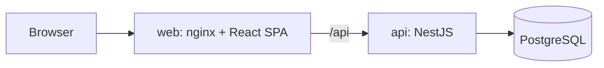
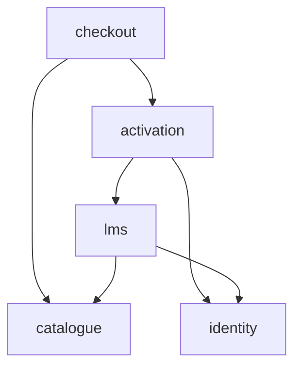
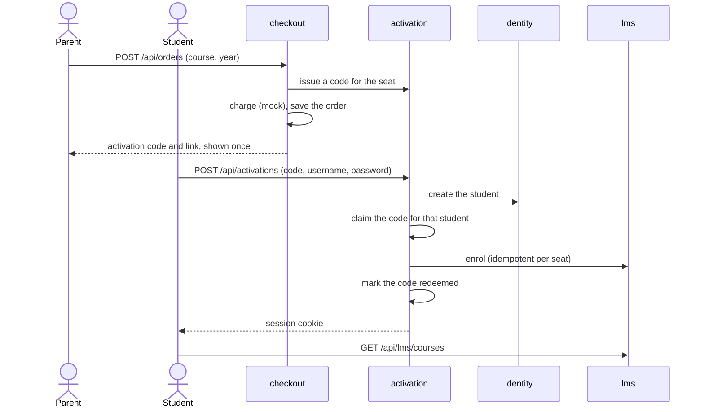

# MyEdSpace take-home — purchase, onboarding, LMS

A small web app that mocks the core journey: a parent buys a course, the student activates
an account with the code from that purchase, then signs in and opens lessons.

React SPA, NestJS API, PostgreSQL, all started by Docker Compose.

## Run it

You need Docker with Compose v2. No `.env` file is needed.

```bash
docker compose up --build
```

Open <http://localhost:8080>. If the port is taken: `WEB_PORT=8081 docker compose up --build`.

| Service | What it does |
|---|---|
| `db` | PostgreSQL 17 |
| `migrate` | One-shot: applies migrations and seeds three courses with nine lessons, then exits |
| `api` | NestJS API; not published to the host |
| `web` | nginx: serves the SPA and proxies `/api` to `api`; the only published port |

`docker compose down -v` removes the data. Optional settings are described in
[`.env.example`](.env.example).

## Walk the journey

1. **Choose a course.** On `/` pick a course and the "Student's school year" — only years
   the course covers are offered — then "Continue to checkout".
2. **Pay.** Enter a name and an email address and press "Pay £199". The checkout is a
   mock: no card, no money.
3. **Take the activation link.** The "Payment complete" page shows an activation code and
   an activation link. They are shown once; there is no email.
4. **Create the student account.** Open the link. The code is prefilled. Enter a first
   name, a username (3–20 lower-case letters, digits or underscores) and a password
   (8 characters or more, typed twice), then "Create account". The student lands in the LMS.
5. **Use the LMS.** `/lms` shows "Welcome, <name>", the course and its lessons. Open one.
6. **Sign out and back in.** "Sign out", then open `/lms`: it redirects to `/login`. Sign
   in with the username and password.

Things to try:

- Open the activation link again and submit the form: "This code has already been used."
- Open `/lms` or a lesson URL in a private window: the LMS is closed without a session.
- Beyond the brief: buy a second course, then "Add a course" in the LMS and paste the code.
  A code for a course the student already has is refused there, and stays valid for
  another student.

## Tests

Needs Node 22.12 or newer and `npm ci` at the repository root.

| Command | What runs | Needs Docker |
|---|---|---|
| `npm test` | 79 API unit tests (Jest) and 102 SPA tests (Vitest, React Testing Library) | no |
| `npm run test:int` | 207 API integration tests over HTTP against a real PostgreSQL (Testcontainers) | yes |

The integration tests carry the weight: access rules, single use of a code under concurrent
requests, and every interrupted step of the multi-step writes described below. There is no
browser end-to-end suite; the walk above is the manual check.

## Architecture



One origin, so there is no CORS and the session cookie is same-site. Request and response
types shared by both sides live in `packages/contracts` (types only).

### Modules

The API is a modular monolith (ADR 012). Each module owns its tables; another module
reaches them only through the owner's exported service, never by a join or a shared
transaction. These are the seams along which it could be split into services. A few
foreign keys still cross module boundaries while everything is in one database; no code
reads across them.



| Module | Owns | Endpoints |
|---|---|---|
| `catalogue` | `Course`, `Lesson` | `GET /api/courses` |
| `checkout` | `Order`, `OrderSeat` | `POST /api/orders` |
| `activation` | `ActivationCode` | `POST /api/activations` (onboarding), `POST /api/redemptions` (add a course, session required) |
| `identity` | `Student` | `GET`, `POST`, `DELETE /api/session` |
| `lms` | `Enrolment` | `GET /api/lms/courses`, `GET /api/lms/courses/:courseId/lessons/:lessonId` (session required) |

`GET /api/session` also needs a session. `GET /api/health` serves the compose healthcheck.

### The journey as a sequence



### Writes that cross modules, without a shared transaction

A single database transaction would be the easy answer today and would not survive a split
into services. Each sequence is instead ordered so that an interruption at any step leaves
a state that is safe and can be finished later.

| Flow | Order of steps | What an interruption leaves |
|---|---|---|
| Checkout (ADR 021) | issue codes → charge → save the order | A code nobody has seen, never a saved order without a code. One case stays open: a charge whose order then fails to save; a provider webhook would reconcile it |
| Onboarding (ADR 022) | create the student → claim the code → enrol → confirm | The claim is one conditional update and is the single-use gate. An interrupted redemption is finished for the student in the claim, never for whoever presents the code next. At worst an account without a course; never a lost seat |
| Add a course (ADR 027) | check for a duplicate → claim → enrol → confirm | The check can be stale, so the unique index on (student, course) is the real rule; on a late duplicate the claim is released. This is the only compensating step in the system |

The price is more states and more tests than one transaction would need.

### Security

- **Activation code**: 15 random characters, stored only as a hash, shown once, never
  logged, carried in the URL fragment so it stays out of server logs (ADR 009, 020).
- **Passwords**: scrypt with a per-password salt and a constant-time comparison.
- **Session**: a signed token in an `HttpOnly`, `SameSite=Strict` cookie scoped to `/api`,
  valid for four hours. The signing secret is not in the repository; when none is
  configured the API generates one at start (ADR 008, 024).
- **Sign-in**: one answer for an unknown username and a wrong password, at about the same
  cost in time (ADR 026).
- **Requests**: JSON bodies only, so a form on another site cannot post to the API;
  unknown fields are rejected, so a client cannot send a price (ADR 018, 026).
- **LMS access**: the student id comes only from the session, and every read goes through
  that student's enrolment. A lesson of a course not owned answers 404, the same as a
  lesson that does not exist (ADR 025). The SPA route guard is a convenience only.

### What is mocked

Payment (a gateway interface with one implementation that always approves), email (the
link is shown on the page), lesson content (seeded plain text), and the visual language
(an approximation described in [`web/DESIGN_SYSTEM.md`](web/DESIGN_SYSTEM.md), with no
MyEdSpace assets).

The parent's name and email address are saved with the order and not used further: with
guest checkout they are what identifies the buyer, and the email is where production would
send the activation link.

## Key decisions

Every decision is an ADR with its alternatives and what production would do differently.
The ones that shaped the system:

| Decision | Why | ADR |
|---|---|---|
| One NestJS backend as a modular monolith, no Java service | One deployable fits the time box; module boundaries keep a later split cheap | [012](.planning/adr/012-modular-monolith-no-java.md) |
| Guest checkout; the student record is created at onboarding | The brief's parent only pays; the student is the one who has an account | [001](.planning/adr/001-guest-checkout.md), [004](.planning/adr/004-student-created-at-onboarding.md) |
| The purchase produces a single-use activation code, stored as a hash | It is the only link between a payment and an account, so it is treated as a credential | [009](.planning/adr/009-activation-code.md), [020](.planning/adr/020-handling-the-activation-code.md) |
| Codes are issued before the order is saved | A failure can leave an unused code but never a paid order without access | [021](.planning/adr/021-codes-issued-before-the-order.md) |
| Redemption is a claim bound to the student, resumable, no shared transaction | Single use holds under concurrency, and a crash mid-way never loses a paid seat | [022](.planning/adr/022-redemption-without-a-shared-transaction.md) |
| A code can also add a course to an existing account | A second purchase should not force a second account | [005](.planning/adr/005-second-purchase-for-existing-student.md), [027](.planning/adr/027-adding-a-course-to-an-existing-account.md) |
| Session token in an `HttpOnly` cookie; username instead of email | Not readable by scripts; a child may not have an email address | [007](.planning/adr/007-student-logs-in-with-username.md), [008](.planning/adr/008-jwt-in-httponly-cookie.md), [026](.planning/adr/026-login-and-logout-contract.md) |
| LMS reads are scoped by enrolment and answer 404 otherwise | There is no path that returns a lesson by id alone | [025](.planning/adr/025-lms-contract-and-access-rule.md) |
| PostgreSQL with Prisma; migrations as a one-shot compose service; integration tests on a real database | The rules that matter here are unique indexes and conditional updates, which a fake database does not prove | [006](.planning/adr/006-postgresql-prisma-migrations-as-a-step.md), [013](.planning/adr/013-test-strategy.md) |

Full register: [`.planning/adr/README.md`](.planning/adr/README.md) (27 decisions).

## How AI was used

The code, tests and documents were written by an AI agent: Claude Code with Claude Opus 5.5.
I made every architecture and product decision and approved each step.

**Process.** The rules are in [`CLAUDE.md`](CLAUDE.md). Work was cut into vertical slices
([`ROADMAP.md`](.planning/ROADMAP.md)); each slice went through a fixed pipeline of
subagents defined in [`.claude/agents/`](.claude/agents):

```
planner → tdd-guide (failing tests first) → implementation →
typescript-reviewer → code-reviewer → security-reviewer
```

The security review was mandatory on the activation path, credentials and LMS access.

**Who decided what.**

| Me | The agent |
|---|---|
| Every architecture and product decision; an ADR was written only after my call | Options, trade-offs and a recommendation for each decision |
| Scope, slice order, what to cut | Plans, tests, code |
| Go-ahead for each step, and the final say on review findings | Reviews of its own output by separate subagents |

**Examples, all traceable in the repository.**

- *I overruled the plan.* The planner designed checkout around one shared transaction for
  the order and its codes. I chose separate transactions with codes issued first
  (ADR 021). [Plan 2](.planning/plans/done/PLAN_slice-2-checkout.md) keeps the rejected
  design next to the decision.
- *A review found a real vulnerability.* The default body parser accepted form-encoded
  bodies, so a form on another site could sign a browser into an attacker's account. The
  API now refuses any body that is not JSON (ADR 026,
  [plan 4](.planning/plans/done/PLAN_slice-4-lms.md)).
- *A review found a data leak in the SPA.* After a session ended without "Sign out", the
  previous student's courses could be served from the client cache. Cache keys are now
  scoped to the student ([plan 4](.planning/plans/done/PLAN_slice-4-lms.md)).
- *Reviews found two races* in the add-course claim step, fixed with a re-read and one
  retry ([plan 5](.planning/plans/done/PLAN_slice-5-add-course.md)).
- *I cut scope.* Adding a course was built in its smallest variant: the code is pasted in
  the LMS rather than carried through sign-in (ADR 027).

**Artefacts.**

- Plans, one per slice, with the decisions taken and, from slice 4 on, what changed
  during implementation:
  [`.planning/plans/done/`](.planning/plans/done)
- Decisions: [`.planning/adr/`](.planning/adr)
- Requirements traced to the brief, roadmap and current state:
  [`REQUIREMENTS.md`](.planning/REQUIREMENTS.md), [`ROADMAP.md`](.planning/ROADMAP.md),
  [`STATE.md`](.planning/STATE.md)
- Agent definitions and the task-to-agent matrix: [`.claude/agents/`](.claude/agents),
  [`AGENT_ASSIGNMENT.md`](.planning/AGENT_ASSIGNMENT.md)
- The commit history: each slice is a short series of decisions, feature commits and a
  closing commit.

**What it cost.** This process produces more documentation and more tests than an exercise
of this size needs. That was the price of keeping every decision mine and checkable.

## Limitations and what production would do

Deliberately not built. The full list with reasons is under "Out of scope" in
[`ROADMAP.md`](.planning/ROADMAP.md).

| Here | In production |
|---|---|
| Guest checkout, no parent account, no email | Parent login, order history, the invitation sent and re-sent by email |
| One student and one course per purchase in the UI (the API accepts several seats) | "Add student", several subjects, bundle pricing |
| The payment always succeeds; a failed charge would answer a plain 500 | A provider's hosted page, pending orders confirmed by webhook, a distinct upstream error |
| A double submit creates two orders | An idempotency key per checkout attempt |
| Unused codes and accounts without a course are never cleaned up | Removed by age; an outbox instead of resume-on-retry |
| A course added to the wrong account cannot be moved; the year cannot be corrected; a duplicate purchase is not refunded | Done by the parent or by support; duplicates prevented at checkout |
| No rate limiting on checkout, redemption or sign-in | Limits at the gateway and lockout per account |
| Signing out clears the cookie but does not revoke the token (four hours at most) | Short-lived access tokens with a revocable refresh token |
| No password reset | Recovery through the parent's account |
| The final "mark redeemed" step checks that the code is claimed, not by whom; safe because only the claimant reaches it | Bound to the student |
| Lessons are plain text, with no progress | A content service with media and per-student progress |
| No browser end-to-end tests, no CI | A small journey suite; the same test commands on every push |

## Notes

The Inter typeface comes from the `@fontsource-variable/inter` package (SIL Open Font
License).
